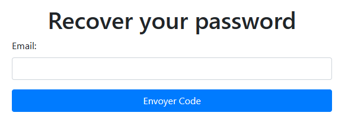
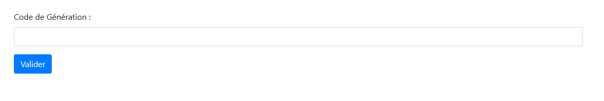
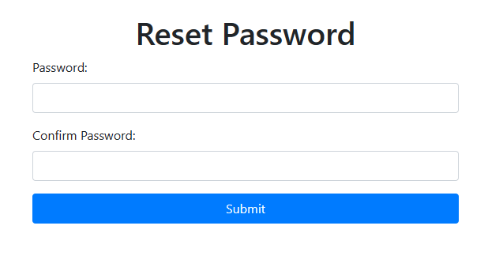

# Application d'Authentification en Java

## Présentation
Ceci est une application web Java simple pour l'authentification des utilisateurs. Les utilisateurs ont la possibilité de s'inscrire, de se connecter, de se déconnecter, et de récupérer leur mot de passe.

## Fonctionnalités
### 1. Page de Connexion
- Sur la page de connexion, les utilisateurs existants peuvent saisir leur nom d'utilisateur et leur mot de passe.
- Une fois connectés avec succès, ils accèdent à leur espace personnel.

   

### 2. Page d'Inscription
- Les nouveaux utilisateurs peuvent s'inscrire en fournissant leur nom, prénom, nom d'utilisateur et mot de passe.
- Une fois inscrits avec succès, ils sont redirigés vers la page de connexion pour se connecter.

   

### 3. Déconnexion
- Les utilisateurs connectés ont la possibilité de se déconnecter de leur session.
- Après la déconnexion, ils sont redirigés vers la page de connexion.
- Lorsque l'utilisateur tente de se connecter après s'être déconnecté, il sera redirigé vers l'espace utilisateur s'il était toujours connecté. Si non, il verra la page de connexion.

   

### 4. Récupération de Mot de Passe
- Les utilisateurs ayant oublié leur mot de passe peuvent le récupérer en trois étapes :
  - Entrez votre adresse e-mail.
  - Recevez le code de récupération dans votre boîte de réception e-mail.
  - Définissez un nouveau mot de passe.

   
   
   

## Configuration et Installation
Pour déployer cette application sur votre propre serveur, suivez les étapes suivantes:
1. Clonez ce dépôt Git.
2. Configurez votre base de données (nommée "customer_db") pour stocker les informations des utilisateurs.
3. Modifiez les paramètres de connexion à la base de données dans le fichier de configuration.
4. Compilez et exécutez l'application avec un serveur Java compatible.

## Auteur
Ce projet a été développé par Mohamed OUHAMI.

## Licence
Ce projet est sous licence MIT. Consultez le fichier LICENSE pour plus d'informations.


---

# Gestion des produits avec JSP et Hibernate

Ce README décrit le projet d'une application web de gestion de produits et de passation de commandes, développée en utilisant Hibernate (pour la gestion des données) et JSP (JavaServer Pages) pour l'interface utilisateur. Cette application permet aux utilisateurs de consulter, ajouter, modifier et supprimer des produits, ainsi que de passer des commandes contenant plusieurs produits.

## Configuration de la Base de Données

Avant de commencer à utiliser l'application, assurez-vous d'avoir configuré la base de données. Vous pouvez utiliser une base de données de votre choix (MySQL, PostgreSQL, H2, etc.). Assurez-vous de mettre à jour les informations de connexion à la base de données dans le fichier `hibernate.cfg.xml`.

```xml
<property name="hibernate.connection.driver_class">com.mysql.cj.jdbc.Driver</property>
<property name="hibernate.connection.url">jdbc:mysql://localhost:3306/votre_base_de_donnees</property>
<property name="hibernate.connection.username">votre_utilisateur</property>
<property name="hibernate.connection.password">votre_mot_de_passe</property>
```

## Fonctionnalités de l'Application

L'application offre les fonctionnalités suivantes :

1. **Liste de Produits :** Les utilisateurs peuvent consulter la liste des produits disponibles. Chaque produit affiche son nom, prix, description, et une option pour l'ajouter à un panier.

2. **Gestion de Produits :** Les administrateurs peuvent ajouter de nouveaux produits, modifier les informations des produits existants, et supprimer des produits de la base de données.

3. **Gestion de Commandes :** Les utilisateurs peuvent consulter les produits dans leur panier, modifier les quantités ou supprimer des produits de leur commande.

## Utilisation de l'Application

1. **Liste de Produits :** Accédez à la page d'accueil pour consulter la liste de produits disponibles.

2. **Gestion de Produits :** Pour ajouter, modifier ou supprimer des produits, connectez-vous en tant qu'administrateur.

3. **Gestion de Commandes :** Utilisez le panier pour gérer les produits que vous souhaitez commander.

## Installation et Exécution

Pour exécuter l'application, suivez ces étapes :

1. Assurez-vous que Java (JDK), Apache Tomcat, et une base de données sont installés sur votre système.

2. Clonez le repository de l'application depuis GitHub.

3. Importez le projet dans votre environnement de développement (par exemple, Eclipse ou IntelliJ IDEA).

4. Configurez la base de données comme décrit précédemment dans le fichier `hibernate.cfg.xml`.

5. Déployez l'application sur votre serveur Tomcat.

6. Accédez à l'application en ouvrant un navigateur et en visitant l'URL du serveur Tomcat.

7. Vous pouvez vous connecter en tant qu'administrateur pour gérer les produits ou en tant qu'utilisateur pour passer des commandes.

---
## Screenshots de l'application


## Technologies Utilisées

- Java
- Hibernate
- JSP (JavaServer Pages)
- Servlets
- HTML
- CSS
- Bootstrap (facultatif pour l'amélioration de l'interface utilisateur)

L'application est un exemple de gestion de produits et de commandes, et elle peut servir de point de départ pour développer des applications similaires. Elle démontre l'utilisation de Hibernate pour la persistance des données et JSP pour l'interface utilisateur.

---

