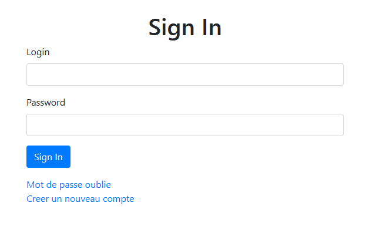
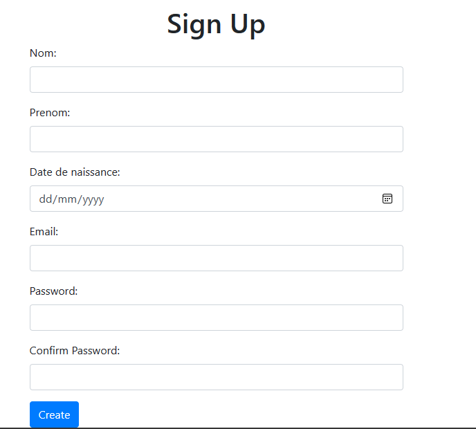

# Application d'Authentification en Java

## Présentation
Ceci est une application web Java simple pour l'authentification des utilisateurs. Les utilisateurs ont la possibilité de s'inscrire, de se connecter et de se déconnecter.

## Fonctionnalités
### 1. Page de Connexion
- Sur la page de connexion, les utilisateurs existants peuvent saisir leur nom d'utilisateur et leur mot de passe.
- Une fois connectés avec succès, ils accèdent à leur espace personnel.

### 2. Page d'Inscription
- Les nouveaux utilisateurs peuvent s'inscrire en fournissant leur nom, prénom, nom d'utilisateur et mot de passe.
- Une fois inscrits avec succès, ils sont redirigés vers la page de connexion pour se connecter.

### 3. Déconnexion
- Les utilisateurs connectés ont la possibilité de se déconnecter de leur session.
- Après la déconnexion, ils sont redirigés vers la page de connexion.

## Configuration et Installation
Pour déployer cette application sur votre propre serveur, suivez les étapes suivantes :
1. Clonez ce dépôt Git.
2. Configurez votre base de données pour stocker les informations des utilisateurs.
3. Modifiez les paramètres de connexion à la base de données dans le fichier de configuration.
4. Compilez et exécutez l'application avec un serveur Java compatible.

## Auteur
Ce projet a été développé par Mohamed OUHAMI.
